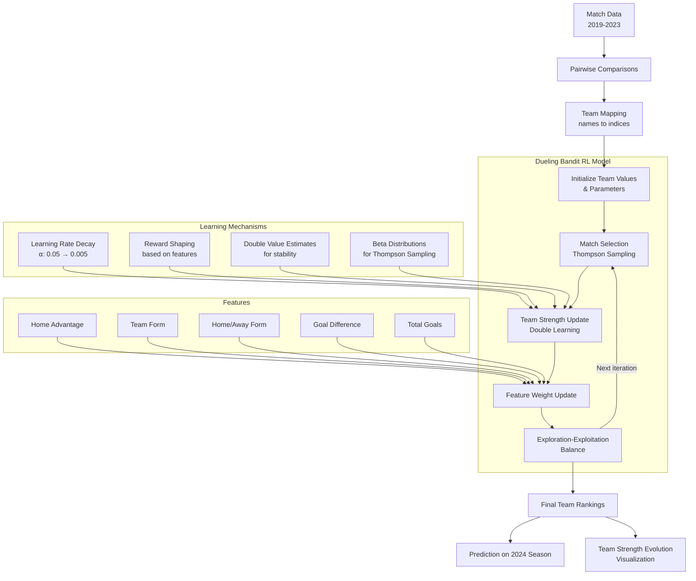

# EliteRL: Reinforcement Learning for Football Rankings

A machine learning project that uses reinforcement learning techniques to predict and rank football teams in the Norwegian Eliteserien league. This project compares the performance of a dueling bandit reinforcement learning approach against traditional models like Bradley-Terry, Logistic Regression, and Random Forest.

## Reinforcement Learning Workflow



## Overview

This project implements and evaluates several approaches to ranking football teams based on match outcomes:

- **Dueling Bandit Reinforcement Learning**: An enhanced RL model that learns team strengths through pairwise comparisons
- **Bradley-Terry Model**: A traditional statistical model for pairwise comparisons
- **Logistic Regression**: A machine learning approach using team features
- **Random Forest**: An ensemble learning method for match outcome prediction

The models are trained on Eliteserien data from 2019-2023 and evaluated on the 2024 season.

## Features

- Data processing pipeline for real football match data
- Implementation of multiple ranking algorithms
- Comprehensive evaluation metrics (prediction accuracy, ranking correlation)
- Visualization tools for comparing model performance
- Feature importance analysis

## Results

The models are evaluated based on their ability to predict match outcomes and produce rankings that correlate with actual season standings. Performance metrics include prediction accuracy, Kendall's Tau correlation, and average rank distance.

## Requirements

- Python 3.8+
- NumPy
- Pandas
- Matplotlib
- Scikit-learn
- Seaborn
- tqdm

## Project Structure

- `data/`: Contains raw and processed match data
- `src/`: Source code for the project
  - `data_processing.py`: Functions for data preprocessing
  - `rl_model.py`: Implementation of the RL ranking model
  - `traditional_models.py`: Implementation of baseline models
  - `evaluation.py`: Functions for evaluating model performance
- `notebooks/`: Jupyter notebooks for analysis and visualization
- `main.py`: Main script to run the entire pipeline

## Setup and Installation

1. Clone this repository
2. Install dependencies:
   ```
   pip install -r requirements.txt
   ```
3. Run the main script:
   ```
   python main.py
   ```

## Data

The project uses match data from the Norwegian Eliteserien football league from 2019-2024, including:
- Home team, Away team
- Final scores
- Match outcomes

## Methodology

The project implements a dueling bandit RL approach where:
- Teams are treated as arms (options)
- Match results are pairwise comparisons
- UCB-based exploration-exploitation strategy is used to improve ranking accuracy 